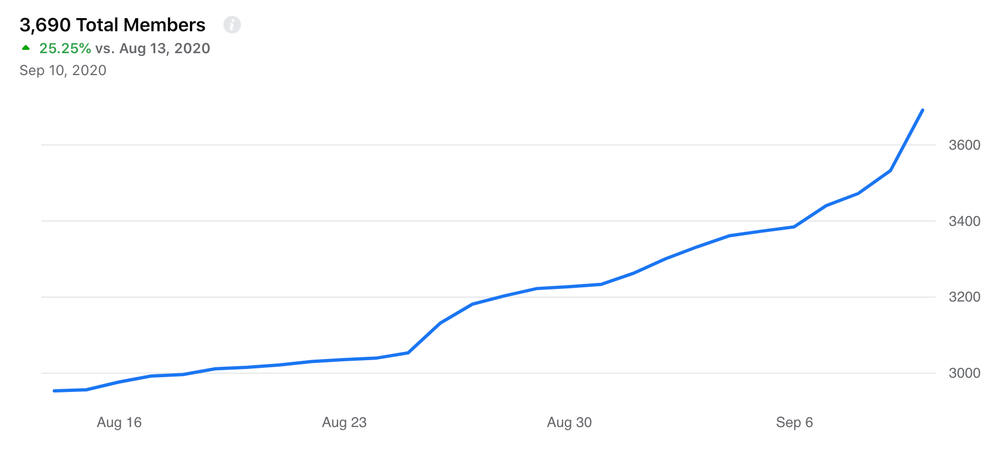
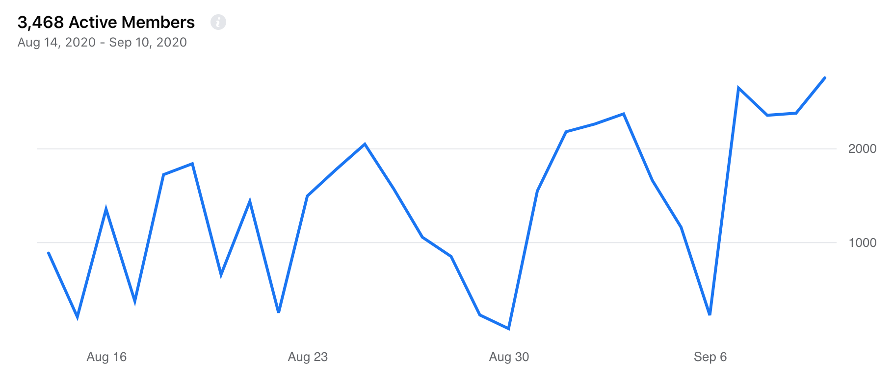
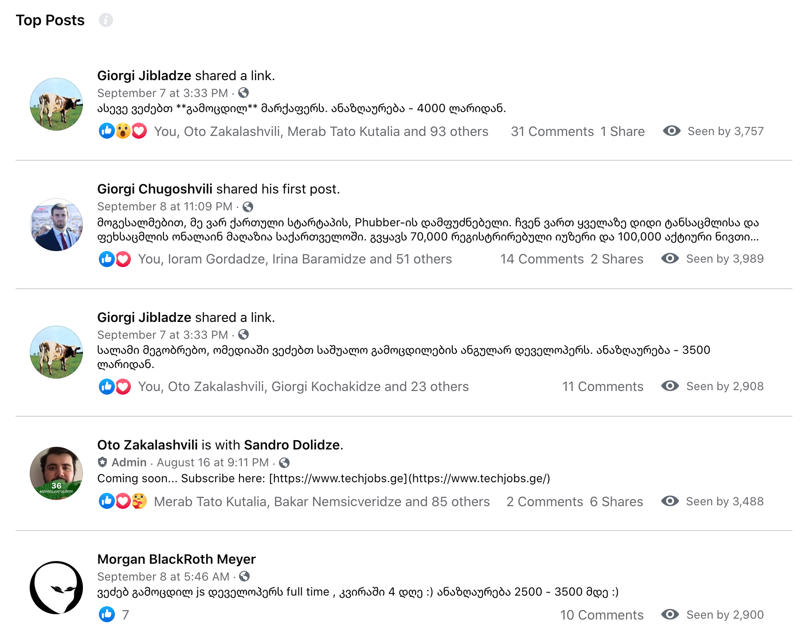
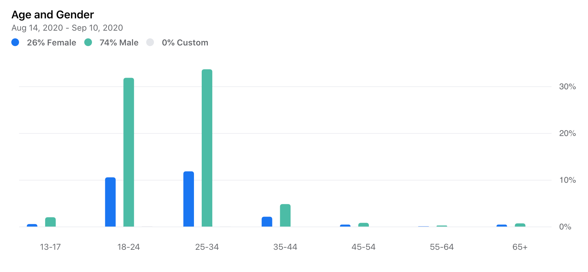

# Tech Jobs Georgia

სანამ [Tech Jobs](https://www.techjobs.ge) პლათფორმა დაილანჩება, გირჩევთ გამოიყენოთ ჩვენი ჯგუფი - [Tech Jobs Georgia](https://www.facebook.com/groups/1618717495035787)

ჯგუფი **საკმაოდ** მზარდი და აქტიურია, არაერთმა კომპანიამ უკვე გითხრა რომ კანდიდატები უკავშირდებიან ჯგუფში დადებული პოსტის გამო.

# რჩევები

1. სასურველია პოსტს ჰქონდეს სურათი (მაგ: ტექნოლოგიის ლოგო ან/და კომპანიის ლოგო).
2. არასასურველია ზედიზედ ორი პოსტი (დაელოდეთ სხვა პოსტს და შემდეგ დადეთ).
3. სასურველია მიუთითოთ შესაბამისი ტოპიკი.
4. შეგიძლიათ ვაკანსიები დააჯგუფოთ, თუმცა ინდივიდუალურ პოსტებს უკეთესი შედეგი აქვს.
5. სახუმარო ან საკამათო პოსტებს, როგორც წესი, მეტი ადამიანი ნახულობს.
6. რაც მეტი რეაქცია ან კომენტარია, მეტი ადამიანი ნახულობს.
7. სახელფასო რეინჯის მითითება, როგორც წესი, დადებითად აისახება მნახველების რაოდენობაზე.

# სტატისტიკა

